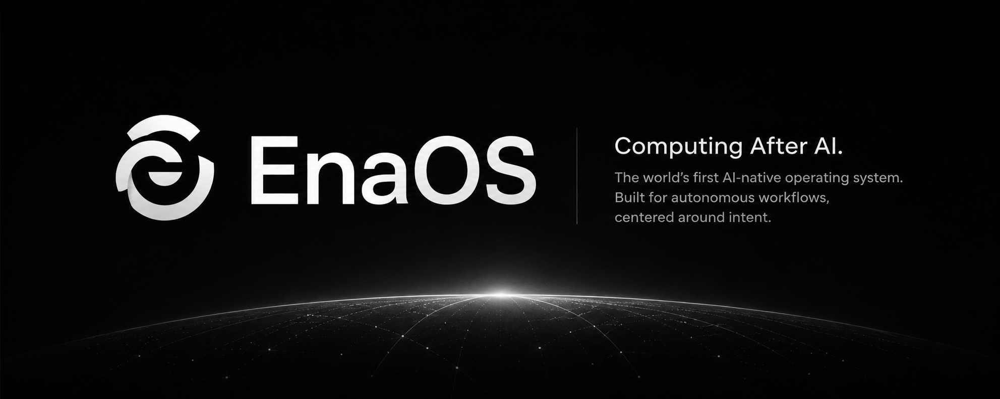

<div align="center">
  
</div>

# EnaOS

### **The AI-Native Desktop Operating Environment.**

EnaOS is a Linux-native shell and runtime that transforms the desktop into a contextually-aware AI interaction layer. No browser. No Electron. No Tauri. Built with Rust, GTK4, and libadwaita — running as a native Wayland layer-shell overlay driven by a Rust daemon.

**[Join the Waitlist](https://enaos.tech/coming-soon)**

---

## Milestones

- [x] **Native GTK4 Ena Bar:** Layer-shell Wayland overlay with real-time rendering
- [x] **Rust Daemon (enad):** Event bus, Unix socket IPC, process lifecycle
- [x] **Desktop Integration:** Battery, network, window focus, workspace, audio, clipboard, notifications
- [x] **System Awareness:** Real OS state streamed into the bar — no simulated UI
- [x] **AI Runtime:** Contextual inference layer with Ollama integration
- [ ] **Agent Engine:** Multi-agent orchestration with baton-passing
- [ ] **Memory Engine:** Vector-graph hybrid for persistent context
- [ ] **Plugin SDK:** WASM-based agent extensions

---

## Architecture

```
┌──────────────────────────────────────────────────────────────┐
│                    Ena Bar (GTK4/libadwaita)                 │
│  ┌──────────┐ ┌───────────┐ ┌──────────┐ ┌────────────────┐ │
│  │StatusDot │ │InputEntry │ │MicButton │ │ ContextLabel   │ │
│  │          │ │           │ │          │ │ Focused: VSCode│ │
│  │          │ │           │ │          │ │ | Workspace 2  │ │
│  │          │ │           │ │          │ │ | ⚡87%        │ │
│  └──────────┘ └───────────┘ └──────────┘ └────────────────┘ │
│         │                    │                                 │
│    HTTP/SSE              Unix Socket                           │
└─────────┼────────────────────┼─────────────────────────────────┘
          │                    │
┌─────────▼────────┐  ┌───────▼────────────────────────────────┐
│  AI Runtime      │  │          enad (Rust daemon)            │
│  (Python/FastAPI)│  │  ┌──────────────────────────────────┐  │
│                  │  │  │          Event Bus                │  │
│  ┌────────────┐  │  │  └───┬──────┬──────┬──────┬────────┘ │
│  │ Ollama     │  │  │      │      │      │      │           │
│  │ (streaming)│  │  │  ┌──▼───┐┌▼─────┐┌▼────┐┌▼────────┐ │
│  └────────────┘  │  │  │UPower│ │NetMgr│ │Window│ │Audio   │ │
│                  │  │  └──────┘ └──────┘ └──────┘ └────────┘ │
│  ┌────────────┐  │  │      │         │        │        │      │
│  │Context     │◄─┼──┘  ┌──▼─────────▼────────▼────────▼────┐ │
│  │Injection   │  │     │     D-Bus + External Tools         │ │
│  └────────────┘  │     │  zbus │ swaymsg │ pactl │ wl-paste │ │
└──────────────────┘     └─────────────────────────────────────┘
```

---

## Project Structure

```
EnaOS/
├── runtimes/
│   ├── enad/              # Rust system daemon (core)
│   │   ├── src/
│   │   │   ├── main.rs    # Entry point, subsystem orchestration
│   │   │   ├── bus.rs     # Event bus (tokio broadcast)
│   │   │   ├── server.rs  # Unix socket IPC server
│   │   │   ├── process.rs # Process lifecycle manager
│   │   │   ├── hooks.rs   # Signal handling
│   │   │   ├── system/    # Desktop integration subsystems
│   │   │   │   ├── upower.rs       # Battery/power state
│   │   │   │   ├── network.rs      # NetworkManager connectivity
│   │   │   │   ├── window.rs       # Window focus tracking
│   │   │   │   ├── workspace.rs    # Workspace awareness
│   │   │   │   ├── clipboard.rs    # Clipboard monitoring
│   │   │   │   ├── notifications.rs# Freedesktop notifications
│   │   │   │   └── audio.rs        # PulseAudio + MPRIS
│   │   │   └── types/
│   │   │       ├── events.rs       # SystemEvent, EventKind, EventPayload
│   │   │       └── ipc.rs          # IpcMessage, Command, Response
│   │   └── Cargo.toml
│   └── ai-runtime/        # Python AI inference layer (coming)
│
├── shell/
│   └── ena-bar/           # Native GTK4 bar (Rust)
│       ├── src/
│       │   ├── main.rs    # GTK4 app, layer-shell setup
│       │   ├── bar.rs     # Widget tree, system context display
│       │   ├── ipc.rs     # Unix socket client
│       │   ├── audio.rs   # Audio capture stub
│       │   ├── config.rs  # CLI args
│       │   └── style.css  # Dark theme
│       └── Cargo.toml
│
├── apps/
│   └── ena-bar/           # Tauri + React bar (legacy/alternative)
│
├── packages/
│   ├── shared-types/      # TypeScript shared types
│   └── design-system.md   # Color palette, typography, component specs
│
├── docs/
│   └── architecture/      # System architecture documents
│
└── scripts/
```

---

## Technology Stack

| Layer | Technology | Purpose |
| :--- | :--- | :--- |
| **System Daemon** | Rust + tokio | Event bus, IPC, process management |
| **Desktop Integration** | zbus (D-Bus) | UPower, NetworkManager, notifications |
| **Frontend** | GTK4 + libadwaita | Native rendering, layer-shell overlay |
| **Wayland** | gtk4-layer-shell | Bottom-anchored overlay surface |
| **Window Tracking** | swaymsg / hyprctl / gdbus | Multi-compositor support |
| **Audio** | pactl + MPRIS D-Bus | Volume, device, media playback |
| **Clipboard** | wl-clipboard / xclip | Content change monitoring |
| **AI Runtime** | Python + FastAPI + Ollama | Contextual inference, streaming |

---

## Quick Start

### Prerequisites

- Linux with Wayland (GNOME, Sway, or Hyprland)
- Rust 1.75+
- Python 3.11+
- GTK4 + libadwaita development libraries
- D-Bus session and system buses
- Ollama (for AI runtime)

### Build enad (System Daemon)

```bash
cd runtimes/enad
cargo build --release
```

### Build ena-bar (GTK4 Frontend)

```bash
cd shell/ena-bar
cargo build --release
```

### Build AI Runtime (Python)

```bash
cd runtimes/ai-runtime
pip install -r requirements.txt
```

### Run

```bash
# 1. Start the daemon
./runtimes/enad/target/release/enad --socket /tmp/enad.sock

# 2. Start the AI runtime (requires Ollama running)
cd runtimes/ai-runtime
python3 -m src.main

# 3. Start the bar (in another terminal)
./shell/ena-bar/target/release/ena-bar --socket-path /tmp/enad.sock
```

### Test the AI Runtime

```bash
# Check health
curl http://localhost:8900/health

# Get current desktop context
curl http://localhost:8900/context

# Chat (non-streaming)
curl -X POST http://localhost:8900/chat \
  -H "Content-Type: application/json" \
  -d '{"query": "What app am I working in?"}'

# Chat (streaming)
curl -X POST http://localhost:8900/chat/stream \
  -H "Content-Type: application/json" \
  -d '{"query": "What app am I working in?"}'
```

### Desktop Integration Requirements

| Subsystem | Required Package | Optional |
| :--- | :--- | :--- |
| Battery | `upower` | — |
| Network | `NetworkManager` | — |
| Window Focus | `sway` / `hyprland` / `gnome-shell` | `xprop` (fallback) |
| Clipboard | `wl-clipboard` | `xclip` (X11 fallback) |
| Audio | `pulseaudio` / `pipewire-pulse` | — |
| Notifications | Any fdo.Notifications server | — |

---

## IPC Protocol

All communication between `ena-bar` and `enad` happens over a Unix domain socket using line-delimited JSON:

```json
{"id": "uuid", "type": "Subscribe", "body": {"kinds": []}}
{"id": "uuid", "type": "Ping"}
{"id": "uuid", "type": "Pong"}
{"id": "uuid", "type": "Event", "body": {"source": "upower", "kind": "System", "payload": {"type": "BatteryStatus", "data": {"percentage": 87.2, "state": "discharging"}}}}
```

---

## Design Philosophy

- **Daemon-driven:** The frontend is a thin reactive renderer. All business logic lives in `enad`.
- **Real state only:** No simulated UI, no fake workflows. Every bar element reflects actual OS state.
- **Graceful degradation:** If a subsystem is unavailable, it logs and exits cleanly — enad never crashes.
- **Compositor-agnostic:** Window tracking works on GNOME, Sway, and Hyprland with xprop fallback.
- **Local-first:** Designed for local inference. Cloud is a fallback, not a requirement.

---

## Core Modules

### 📡 Ena Bar (`/shell/ena-bar`)
Native GTK4 layer-shell panel. Renderer-only — all state comes from enad. Displays focused app, workspace, battery, network, and media context.

### ⚙️ enad (`/runtimes/enad`)
Rust system daemon. Event bus, Unix socket IPC, desktop integration (UPower, NetworkManager, window tracking, clipboard, audio, notifications). The operating system event nucleus.

### 🧠 AI Runtime (`/runtimes/ai-runtime`)
Python contextual inference layer. Subscribes to enad events, maintains live desktop state snapshot, injects context into LLM prompts, streams responses via SSE. Local-first via Ollama.

---

## License

EnaOS is released under the **MIT License**.
